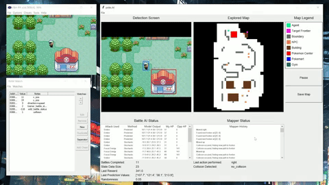
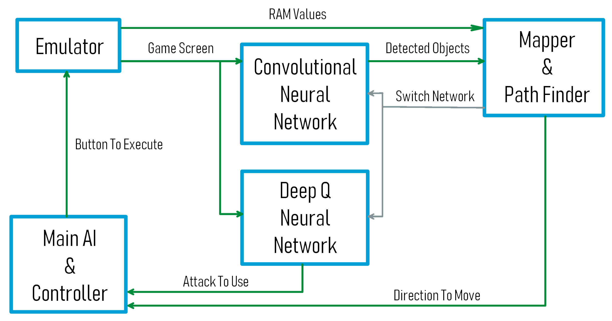
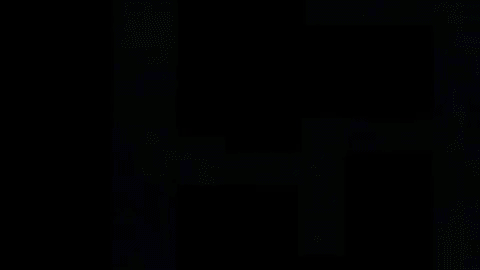
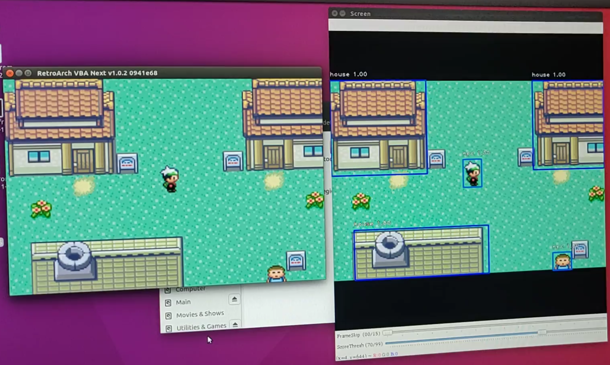
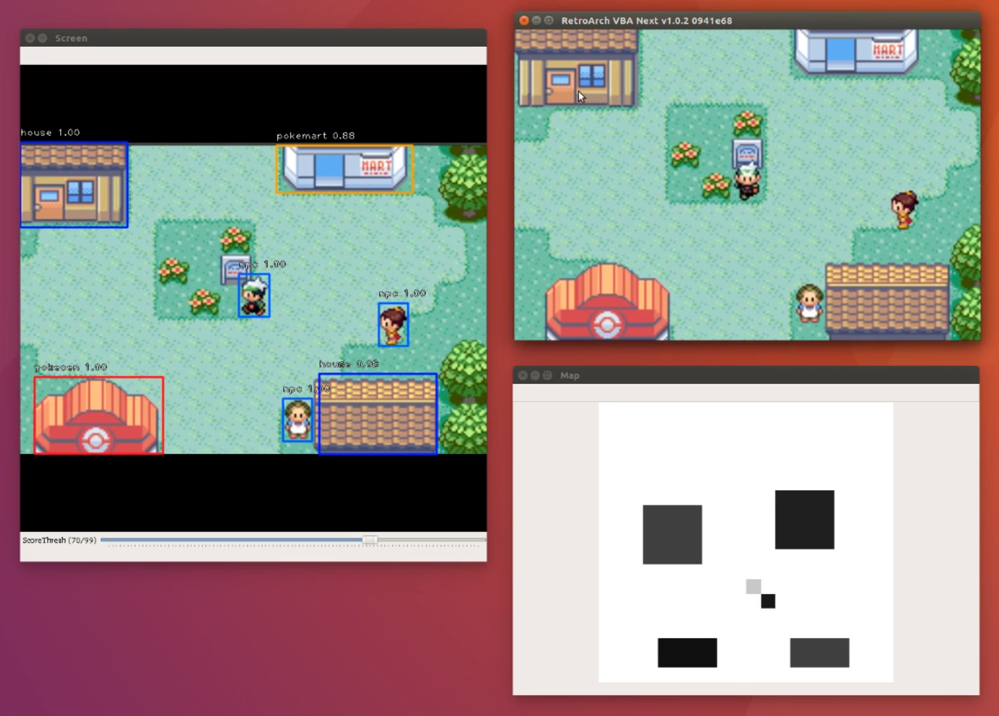
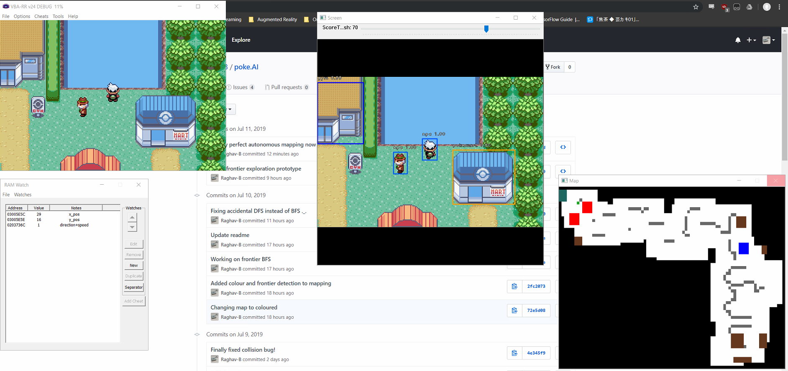

# poke.AI

An experimental project to attempt to create an AI that can play the 3rd generation Pokemon games (specifically Pokemon Emerald - it's very close to my heart).

    

## Introduction

A little bit of a disclaimer before we continue - it is very unlikely that given current technology we can create an AI that can actually *learn* how to play any of the Pokemon games from first principles. This is an issue with most open-world games as they have many mini-games (or rather mechanics) that come together to create the complete game. 

Although we have seen development in the field of Reinforcement Learning with regards to teaching a [neural network how to play the Atari games](https://arxiv.org/abs/1312.5602) using Q-Learning or Deep Q-Learning, these games are relatively simplistic in scale when compared to the complexity of Pokemon Emerald, so much so that a single convolutional neural network can be used to model these Atari games.

To further illustrate this point, here are the core mechanics of Space Invaders as compared to Pokemon Emerald:

| Space Invaders | Pokemon Emerald |
| --- | --- |
| Shoot aliens, dodge bullets, get points | Explore the world |
| . | Collect Pokemon and items |
| . | Engage in Pokemon battles |
| . | *and a whole host of other mechanics* |

It's possible I haven't done Space Invaders enough justice but this should still illustrate my point (I grew up with Pokemon, not Space Invaders so my bias is completely justified). Furthermore, each of these mechanics contain a whole host of sub-mechanics ranging from pseudo-metroidvania style gameplay when unlocking new paths in the open world, learning the Pokemon-type meta-game, coming up with killer movesets, etc.

And so the difficulty arises in trying to figure out how a single AI can be used to learn all these different mechanics and nuances. Well, the answer is fairly clear for now - we design a separate module to handle each aspect of the game differently. 

_BUT WAIT RAGHAV - THAT ISN'T AI, WHAT ABOUT MY DREAMS OF CORTANA/SKYNET/HAL/JUST MONIKA?!_

No, of course it isn't - not with that definition of AI. Until we achieve the holy grail of an [Artificial General Intelligence](https://en.wikipedia.org/wiki/Artificial_general_intelligence) we are very far from the AI often seen in popular culture. (Although some would say that Deep Reinforcement Learning is one step in the right direction)

By letting go of our obsession with AI being this omniscient, mystical being, we allow ourselves to see that in its current state, AI can still be used to automate many tasks, and can learn patterns or draw distinctions that way beyond what can be possibly conceived by the human brain - thanks in part to how artificial neural networks are [universal function approximators](https://en.wikipedia.org/wiki/Universal_approximation_theorem).

So what does this mean for this Pokemon AI? Well yes, there are many parts of this project that will be automated and will leverage on the power of neural networks. However AI and computers in general are dumb, and so there is definitely an element of providing supervision and foundational instructions to these algorithms. Nothing to be ashamed about, this is just the current state of AI.

Anyways, I've rambled on for too long, lets dive into the technical details. You can find most of the main code [right here.](object_detection/keras-retinanet/ai/)

## Features / Modules

For an overview of how the AI works and how its modules interact with each other, see the schematic below.

    

You may watch a (slightly outdated) video describing the project below:

### Localization and Mapping of Game World - Computer Vision & SLAM-inspired Algorithm

After running the AI for about an hour, it was able to map out a modest chunk of the game-world. Note that these results were after mapping was used in conjunction with frontier-based exploration (see below).

    

This is at the absolute core of our AI. Without being able to localize itself in the game and without storing locations of objects and places of interest in memory, our agent won't be able to do anything apart from moving around randomly. (Interestingly, given how probability works, there probably exists a parallel universe somewhere where the AI has finished the game from start to finish purely on randomness alone). Hence we have to figure out a way to give our agent access to this information, because this is exactly what a human player does when playing any game.

Bringing the analogy of a human player further, we can use a Convolutional Neural Network (CNN) to perform object detection on every frame of gameplay to detect objects (also because believe it or not, finding the locations of these objects through the ROMs RAM is significantly harder. Also object detection is really cool to look at! - when it works).

For now, the CNN has been trained to detect the following objects:
* NPCs
* Assorted Houses
* Pokemon Gyms
* Pokecenters
* Pokemarts
* Exits (Unused for now)
The plan is to add more classes once the other core features have been developed.

    

So now our AI can see objects in its immediate environment, but how does it remember the locations of these objects? As soon as an object disappears from the frame and re-enters it at a later time, our agent has no way of knowing it is encountering a previously detected object again!

This is where I took a bit of inspiration from [SLAM (Simultaneous Localization and Mapping)](https://en.wikipedia.org/wiki/Simultaneous_localization_and_mapping). By using the movement of our agent (odometry), we try to estimate the expected location of objects that we have detected. However, we have an inherent advantage because there is nothing to estimate in mapping a Pokemon Game World - everything is fixed to a Tile on screen so all coordinates are absolute. So instead of estimation, all we have to do is store all our detected objects in a list somewhere, come up with a way to check if any newly detected objects already exist in our list, and converting the coordinates of the detectd objects from a local scale (our game screen) to the global scale (ground truth map of the entire game).

    

The [mapper.py](ai/mapper.py) script handles most of the mapping and localization process. 

### Automated Movement in the Game World - Frontier-based Exploration

Now that we have a mapping algorithm, our AI will know exactly where to go! - which might be what you're thinking, but that's wrong. Currently the agent follows a pre-defined set of sequential instructions, [or can move around randomly](https://www.youtube.com/watch?v=PQ_kMoVHZYc). How do we teach the AI how to move around?

After a bit of thinking, it dawned on me that there was no need to really use an AI for this part. This is yet another time when we take inspiration from the field of robotics, specially, something known as Frontier-Based Exploration. This algorithm introduces the concept of *frontiers*, which are points on the boundary of the explored and unexplored regions of an area that a robot/agent is present in. Approaching these frontiers will allow more of the region to be explored. The agent chooses a frontier based on the score assigned to it. In our case, a frontier's score is determined by the types of tiles around it. For example, a frontier next to a boundary will be given a negative score, while a frontier next to the part of a detected house or NPC will be given a higher score.

    

We run a simple Breadth First Search (BFS) on the unexplored region (shown by the black tiles) to find a frontier with the highest score. Next, we run another BFS from our agent's current global position to the frontier's position, getting a sequence of actions that will take us to the frontier. The agent will correct its path accordingly if it runs into a collision or detects any new objects blocking its initial path to the frontier.

The [path_finder.py](ai/path_finder.py) script handles the exploration part of the AI. This is used in tandem with the aforementioned [mapper.py](ai/mapper.py).

### Learning to Battle Pokemon (And Win) - Deep Q Learning

    

So far you might feel like you've been cheated. Our AI didn't really *learn* how to play Pokemon - I'm just giving it a general idea about what to do. If you feel this way too then you should find this section a lot more interesting. This is where we plan to incorporate Deep Q-Learning to the Pokemon battle system to get our agent to learn what to do in a fight to get the highest winrate possible. I would suggest [reading up about Deep Q-Learning](https://www.intel.ai/demystifying-deep-reinforcement-learning/#gs.w14f96) to gain a better understanding of how it works.

The reward function used is extremely simplistic, it simply takes the difference between the opponent's initial and final health, and your initial and final health after performing a certain move. A move that did more damage to the opponent than the opponent did to you in a single turn, is deemed to be a better move.

Admittedly, there isin't really a need to use a DQNN (Deep Q Neural Network) to figure out the strongest moves, instead we can just keep a total of the damage we've done with each move

This will be done based on a custom reward function and repeated Pokemon battles to train our neural network. Again, seeing my time contraints and skill level, the battle system won't be fully explored, instead it will focus on training an agent to get as high a winrate as possible with a particular Pokemon with 4 fixed moves. Think of this as a proof of concept - given enough battles with a particular Pokemon, our agent can learn the strongest and most reliable moves. For the sake of simplicity, we won't be looking into Pokemon type differences for now, though this is a definite area of exploration going into the future.

The [battle_ai.py](ai/battle_ai/battle_ai.py) script handles most of this training process.

### Going Further

For the first prototype/minimum viable product/whatever you like to call it, my focus is just on the 3 mechanics above, seeing as how core they are to the gameplay of Pokemon. Once they have been developed adequately, they can be taken further to incorporate more complex behavious such as entering houses, finding particular NPCs, taking cues from in-game text, etc.

## Libraries Used

* [VBA Rerecording](https://github.com/TASVideos/vba-rerecording) - windows-based GBA emulator
* [AdvanceMap](https://hackromtools.altervista.org/advance-map/) - modifying GBA ROM maps (apologies if I couldn't find original source)
* [PyAutoGUI](https://github.com/asweigart/pyautogui) - GUI automation for controlling emulator
* [MSS](https://github.com/BoboTiG/python-mss) - high FPS screencapture for object detection
* [fastgrab](https://github.com/mherkazandjian/fastgrab) - alternate high FPS screencapture
* [Keras RetinaNet](https://github.com/fizyr/keras-retinanet/blob/master/README.md) - model used for object detection
* [LabelImg](https://github.com/tzutalin/labelImg) - to make the task of labelImg images a litle less arduous <3
* [OpenCV](https://opencv.org/) - various image processing and computer vision uses
* [ZMQ](https://github.com/zeromq) - interprocess communication between C++ and Python

## Installation and Setup Guide

Below are the installation instructions for setting up the test environment for this repo on a Windows 10 PC - assuming you have absolutely NONE of the dependencies installed. (I might have missed a few dependencies, but most major things should be here already - [Google](https://lmgtfy.com/?q=how+2+dependencie) exists for a reason!)

Also, I assume you're using a relatively recent NVIDIA GPU for this. (9-series and above).

Our hardware setup for this project is as follows:
* i7-8700K
* GTX 1080Ti
* 16GB RAM

### Installing Python 3.6

* Install Python from the [official website](https://www.python.org/downloads/).
* During the installation, ensure that you check the box for installing `pip` alongside Python 3.6.
* Ensure Python 3.6 has been added to your path by opening a new terminal and entering `python --version`. This should report your Python version as 3.6.x.
* Run the following command in your terminal: `pip install --upgrade pip`
* Verify `pip` install by typing: `pip --version`

### Install Other Dependencies

* `pip install pillow`
* `pip install lxml`
* `pip install jupyter`
* `pip install matplotlib`

### Install Visual C++ 2015

* [Go to this site](https://visualstudio.microsoft.com/vs/older-downloads/)
* Select "Redistributables and Build Tools"
* Download 64-bit version of "Microsoft Visual C++ 2015 Redistributable Update 3"

### Ensure Long Paths are Enabled in Windows

* [Guide](https://superuser.com/questions/1119883/windows-10-enable-ntfs-long-paths-policy-option-missing)

### Update NVIDIA GPU Drivers

* [Driver Update](https://www.nvidia.com/Download/index.aspx?lang=en-us)

### Install CUDA 10.0

* [Download here](https://developer.nvidia.com/cuda-toolkit-archive)
* Install into the default directory.

### Install cuDNN 7.6.0

* You need a nvidia developer account for this step, but this is free and easy to make
* [Go to this link](https://developer.nvidia.com/cudnn) and click on "Download cuDNN" Make sure you download cuDNN 7.6.0 for CUDA 10.0 only. The download will be called "cuDNN Library for Windows 10.
* Extract the downloaded archive.
* Open your default CUDA installation directory: `C:\Program Files\NVIDIA GPU Computing Toolkit\CUDA\v10.0\`

In the cuDNN extracted folder, copy the following files to the following locations:
* `./cuda/bin/cudnn64_7.dll` to `C:/Program Files/NVIDIA GPU Computing Toolkit/CUDA/v10.0/bin/`
* `./cuda/include/cudnn.h` to `C:/Program Files/NVIDIA GPU Computing Toolkit/CUDA/v10.0/include/`
* `./cuda/lib/x64/cudnn.lib` to `C:/Program Files/NVIDIA GPU Computing Toolkit/CUDA/v10.0/lib/x64/`

### Add CUDA, cuDNN, Etc to System Path Environment Variables

Add the following entries:
* `C:\Program Files\NVIDIA GPU Computing Toolkit\CUDA\v10.0\bin`
* `C:\Program Files\NVIDIA GPU Computing Toolkit\CUDA\v10.0\extras\CUPTI\libx64`
* `C:\Program Files\NVIDIA GPU Computing Toolkit\CUDA\v10.0\include`

Now restart your PC

### Install Tensorflow-GPU

* Open a new terminal and run `pip install --user --upgrade tensorflow-gpu==1.13.1`
* Test installation: `python -c "import tensorflow as tf;print(tf.reduce_sum(tf.random.normal([1000, 1000])))"`

### Setting up this Repository

* `git clone https://github.com/Raghav-B/poke.AI` to your desired directory.
* `cd cctv_crash_detector/keras-retinanet`
* `pip install . --user` - This should install all remaining dependencies.
* `python setup.py build_ext --inplace`
* If you are missing any libraries later on, they should be fairly easy to install using `pip`.

### Getting Infernece Graph and Video Files

These files are too large to be uploaded to GitHub, so you'll have to download them yourself and place them inside the cloned repository.
* [Inference Graph](https://mega.nz/#F!AtcH1IbL!u7M8O2FXcsdyLc53pwCORA) - Place `.h5` files under `object_detection/keras-retinanet/inference_graphs/`
